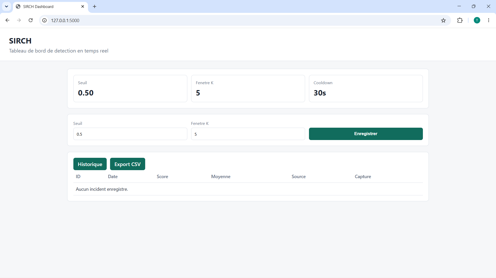

# SIRCH

**Systeme Intelligent de Reconnaissance de Comportements Humains**

SIRCH est un systeme Python de detection de violence dans une webcam, une video
ou un flux IP/RTSP. Il analyse des sequences de 20 frames avec un modele
EfficientNetB0 + LSTM, stabilise la decision sur plusieurs scores, puis peut
enregistrer une capture, archiver l'incident et envoyer des alertes.

Depot GitHub : [github.com/Ertual/SIRCH-](https://github.com/Ertual/SIRCH-)

Presentation technique :
[docs/presentation_technique_SIRCH.pptx](docs/presentation_technique_SIRCH.pptx)

Rapport technique du code :
[docs/rapport_technique_code_SIRCH.md](docs/rapport_technique_code_SIRCH.md)



## Fonctionnalites

- acquisition par webcam, fichier video ou flux RTSP/IP ;
- pretraitement en sequences de 20 images de 224 x 224 pixels ;
- inference TensorFlow avec EfficientNetB0 + LSTM 256 ;
- decision avec seuil configurable et moyenne glissante `K=5` ;
- affichage camera avec score, moyenne, seuil et statut en direct ;
- alerte sonore, Gmail et Telegram facultatif ;
- cooldown de 30 secondes entre deux alertes ;
- capture automatique et historique SQLite ;
- dashboard Flask pour les reglages, incidents, captures et export CSV.

## Architecture en 7 modules

| Module | Fichier principal | Role |
|---|---|---|
| 1. Acquisition | `core/acquisition.py` | Ouvre la webcam, une video ou un flux reseau. |
| 2. Pretraitement | `core/preprocessing.py` | Redimensionne et construit les sequences de 20 frames. |
| 3. Inference IA | `core/inference.py` | Charge le modele et calcule un score entre 0 et 1. |
| 4. Decision | `core/decision.py` | Applique la moyenne glissante et le seuil. |
| 5. Alertes | `alerts/alertmanager.py` | Declenche son, Gmail et Telegram si configure. |
| 6. Donnees | `database/db.py` | Enregistre les incidents et reglages dans SQLite. |
| 7. Dashboard | `dashboard/app.py` | Affiche l'historique, les captures et les reglages. |

`main.py` orchestre tous ces modules dans la boucle temps reel.

## Modele IA

Pipeline principal :

```text
20 frames
   -> redimensionnement 224 x 224
   -> EfficientNetB0 pour les caracteristiques visuelles
   -> LSTM 256 pour l'evolution temporelle
   -> couche sigmoid
   -> probabilite de violence
```

Le modele n'est pas stocke dans GitHub a cause de sa taille. Par defaut,
`config.example.py` attend le fichier ici :

```text
C:\SIRCH_ENV\models\sirch_model.h5
```

## Resultats principaux

Evaluation du modele original deploye sur le jeu principal de **599 videos**,
avec `theta=0.50` :

| Metrique | Valeur |
|---|---:|
| Accuracy | 86,81 % |
| Precision | 82,74 % |
| Rappel | 92,98 % |
| F1-score | 87,56 % |
| Matrice de confusion | TN=242, FP=58, FN=21, TP=278 |
| ROC-AUC | 0,9446 |

Une variante augmentee a atteint 91,99 % d'accuracy et 92,31 % de F1 sur le
meme jeu de test. Les resultats, courbes ROC, matrices de confusion, ablations
et analyses cross-dataset se trouvent dans `phase2_results/` et
`phase3_results/`.

## Prerequis

- Windows 11 ;
- Python 3.10 ;
- webcam pour la demonstration temps reel ;
- modele `sirch_model.h5` disponible localement ;
- Gmail avec mot de passe d'application pour l'alerte email ;
- Telegram facultatif.

## Installation

Dans PowerShell :

```powershell
git clone https://github.com/Ertual/SIRCH-.git
cd SIRCH-

py -3.10 -m venv sirch_env
.\sirch_env\Scripts\Activate.ps1
python -m pip install --upgrade pip
pip install -r requirements.txt

Copy-Item config.example.py config.py
```

Ouvrir ensuite `config.py` et verifier au minimum :

```python
MODEL_PATH = r"C:\SIRCH_ENV\models\sirch_model.h5"
```

Ne jamais publier `config.py`, car il peut contenir des identifiants Gmail ou
Telegram.

## Lancement de la demonstration live

Les commandes doivent etre lancees depuis la racine du projet.

### Terminal 1 : dashboard

```powershell
C:\SIRCH_ENV\Scripts\python.exe -m dashboard.app
```

Ouvrir ensuite :

```text
http://127.0.0.1:5000
```

### Terminal 2 : webcam et detection

```powershell
C:\SIRCH_ENV\Scripts\python.exe main.py --source 0
```

Une fenetre camera s'ouvre avec :

- le score courant ;
- la moyenne des scores ;
- le seuil ;
- la valeur de `K` ;
- le statut `OK` ou `VIOLENCE DETECTEE` ;
- la derniere capture enregistree.

Cliquer sur la fenetre camera puis appuyer sur `q` pour quitter.

### Reglages faible latence

```powershell
C:\SIRCH_ENV\Scripts\python.exe main.py --source 0 --infer-every 5 --camera-width 640 --camera-height 480 --camera-fps 15
```

`--infer-every` indique le nombre de frames entre deux predictions. Une valeur
plus grande reduit la charge mais espace les mises a jour du score.

## Ce qui se passe lors d'une detection

1. Le modele calcule un score de violence.
2. `DecisionEngine` calcule la moyenne des `K` derniers scores.
3. Si la moyenne atteint le seuil, SIRCH sauvegarde une capture.
4. L'incident est ajoute dans `database/sirch.db`.
5. Le son et les alertes configurees sont declenches.
6. Le dashboard affiche l'incident et permet d'ouvrir la capture.

Le cooldown evite d'envoyer une nouvelle alerte a chaque frame.

## Alertes

### Gmail

Creer un mot de passe d'application Google, puis renseigner dans `config.py` :

```python
EMAIL_SENDER = "votre_adresse@gmail.com"
EMAIL_PASSWORD = "mot_de_passe_application"
EMAIL_RECEIVER = "destinataire@gmail.com"
```

### Telegram

Telegram est ignore silencieusement si le token ou le chat ID est vide ou
conserve la valeur d'exemple :

```python
TELEGRAM_TOKEN = "METS_TON_TOKEN_ICI"
TELEGRAM_CHAT_ID = "METS_TON_CHAT_ID_ICI"
```

## Tests

```powershell
C:\SIRCH_ENV\Scripts\python.exe -m unittest discover -s tests -v
```

Les tests couvrent notamment :

- la fenetre de decision ;
- la forme des sequences de frames ;
- l'ecriture et la lecture SQLite ;
- les reglages du dashboard ;
- l'absence d'erreur lorsque Telegram n'est pas configure.

## Entrainement et evaluation

Les notebooks sont dans `colab/` :

- `train_sirch.ipynb` : modele original ;
- `train_sirch_augmente.ipynb` : modele avec augmentation ;
- `evaluate_sirch.ipynb` : evaluation ;
- `train_efficientnet_only.ipynb`, `train_gru.ipynb` : ablations ;
- `train_rlvs_only.ipynb`, `train_rwf_only.ipynb` : generalisation cross-dataset.

Les datasets et checkpoints ne sont pas versionnes dans GitHub.

## Structure du depot

```text
SIRCH/
|-- main.py
|-- config.example.py
|-- requirements.txt
|-- alerts/
|-- core/
|-- dashboard/
|-- database/
|-- tests/
|-- colab/
|-- phase2_results/
|-- phase3_results/
|-- docs/
`-- tools/
```

## Depannage rapide

### `No module named config`

Lancer le dashboard comme module depuis la racine :

```powershell
python -m dashboard.app
```

### Modele introuvable

Verifier `MODEL_PATH` dans `config.py` et confirmer que le fichier `.h5`
existe.

### La mauvaise webcam s'ouvre

Tester un autre index :

```powershell
python main.py --source 1
```

### Une capture du dashboard retourne 404

Relancer le dashboard apres mise a jour du code et verifier que le fichier
existe dans `database/captures/`.

## Confidentialite et securite

- Ne jamais committer `config.py`.
- Ne jamais publier `database/sirch.db` ni les captures personnelles.
- Demander le consentement des personnes filmees.
- Pour une demonstration, simuler les mouvements sans contact dangereux.
- SIRCH est un prototype de recherche et ne remplace pas une validation humaine.
